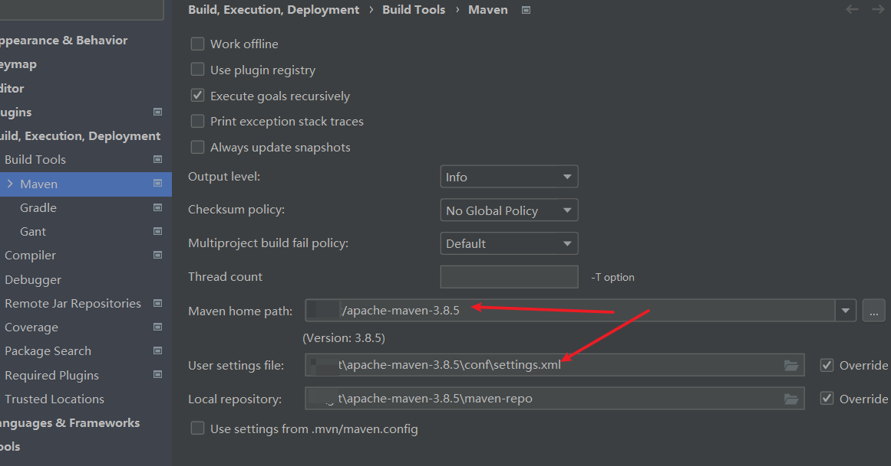
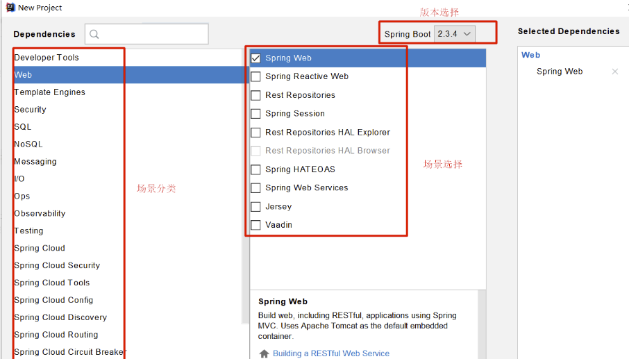

# 课程结构


配置特性(重点)

# 第一季：SpringBoot2核心技术

## 1.SpringBoot2基础入门

### Spring和SpringBoot

#### 1、Spring能做什么

##### 1.1、Spring的能力


##### 1.2、Spring的生态

https://spring.io/projects/spring-boot


覆盖了：

web开发

数据访问

安全控制

分布式

消息服务

移动开发

批处理

......

##### 1.3、Spring5重大升级

###### 1.3.1、响应式编程


###### 1.3.2、内部源码设计

基于Java8的一些新特性，如：接口默认实现。重新设计源码架构。


#### 2、为什么用SpringBoot


Spring Boot makes it easy to create stand-alone, production-grade Spring based Applications that you can "just run".


能快速创建出生产级别的Spring应用


##### 2.1、SpringBoot优点

- Create stand-alone Spring applications

- - 创建独立Spring应用

- Embed Tomcat, Jetty or Undertow directly (no need to deploy WAR files)

- - 内嵌web服务器

- Provide opinionated 'starter' dependencies to simplify your build configuration

- - 自动starter依赖，简化构建配置

- Automatically configure Spring and 3rd party libraries whenever possible

- - 自动配置Spring以及第三方功能

- Provide production-ready features such as metrics, health checks, and externalized configuration

- - 提供生产级别的监控、健康检查及外部化配置

- Absolutely no code generation and no requirement for XML configuration

- - 无代码生成、无需编写XML


SpringBoot是整合Spring技术栈的一站式框架

SpringBoot是简化Spring技术栈的快速开发脚手架


##### 2.2、SpringBoot缺点

- 人称版本帝，迭代快，需要时刻关注变化
- 封装太深，内部原理复杂，不容易精通

#### 3、时代背景

##### 3.1、微服务

[James Lewis and Martin Fowler (2014)](https://martinfowler.com/articles/microservices.html)  提出微服务完整概念。https://martinfowler.com/microservices/

In short, the **microservice architectural style** is an approach to developing a single application as a **suite of small services**, each **running in its own process** and communicating with **lightweight** mechanisms, often an **HTTP** resource API. These services are **built around business capabilities** and **independently deployable** by fully **automated deployment** machinery. There is a **bare minimum of centralized management** of these services, which may be **written in different programming languages** and use different data storage technologies.-- [James Lewis and Martin Fowler (2014)](https://martinfowler.com/articles/microservices.html)

- 微服务是一种架构风格
- 一个应用拆分为一组小型服务
- 每个服务运行在自己的进程内，也就是可独立部署和升级
- 服务之间使用轻量级HTTP交互
- 服务围绕业务功能拆分
- 可以由全自动部署机制独立部署
- 去中心化，服务自治。服务可以使用不同的语言、不同的存储技术

##### 3.2、分布式


###### 分布式的困难

- 远程调用
- 服务发现
- 负载均衡
- 服务容错
- 配置管理
- 服务监控
- 链路追踪
- 日志管理
- 任务调度
- ......


###### 分布式的解决

- SpringBoot + SpringCloud
- 分布式的解决
  - SpringBoot + SpringCloud

##### 3.3、云原生

原生应用如何上云。 Cloud Native

###### 上云的困难

- 服务自愈
- 弹性伸缩
- 服务隔离
- 自动化部署
- 灰度发布
- 流量治理
- ......

###### 上云的解决


#### 4、如何学习SpringBoot

##### 4.1、官网文档架构


查看版本新特性；

https://github.com/spring-projects/spring-boot/wiki#release-notes


### SpringBoot2入门

#### 1、系统要求

- [Java 8](https://www.java.com/) & 兼容java14 .
- Maven 3.3+
- idea 2019.1.2

##### 1.1、maven设置

```xml
<parent>
        <groupId>org.springframework.boot</groupId>
        <artifactId>spring-boot-starter-parent</artifactId>
        <version>2.3.4.RELEASE</version>
    </parent>


    <dependencies>
        <dependency>
            <groupId>org.springframework.boot</groupId>
            <artifactId>spring-boot-starter-web</artifactId>
        </dependency>

    </dependencies>
```

#### 2、HelloWorld

需求：浏览发送/hello请求，响应 Hello，Spring Boot 2 

##### 2.1、创建maven工程

创建mvn工程,注意settings文件的配置和mvn



##### 2.2、引入依赖

```xml
 <!-- 引入SpringBoot   -->
    <parent>
        <groupId>org.springframework.boot</groupId>
        <artifactId>spring-boot-starter-parent</artifactId>
        <version>2.3.4.RELEASE</version>
    </parent>

    <dependencies>
        <dependency>
            <groupId>org.springframework.boot</groupId>
            <artifactId>spring-boot-starter-web</artifactId>
        </dependency>
    </dependencies>
```

##### 2.3、创建主程序

```java
/**
 * 主程序类
 * @SpringBootApplication：这是一个SpringBoot应用
 */
@SpringBootApplication
public class MainApplication {
    public static void main(String[] args) {
        SpringApplication.run(MainApplication.class,args);
    }
}
```


##### 2.4、编写业务

```java
@RestController
public class HelloController {
    @RequestMapping("/hello")
    public String handle01(){
        return "Hello,Spring Boot2!";
    }
}

```


目录结构


##### 2.5、测试

直接运行main方法

##### 2.6、简化配置

application.properties

```xml
server.port=8888
```

##### 2.7、简化部署

```xml
<!-- 简化部署   -->
    <build>
        <plugins>
            <plugin>
                <groupId>org.springframework.boot</groupId>
                <artifactId>spring-boot-maven-plugin</artifactId>
                <version>2.3.4.RELEASE</version>
            </plugin>
        </plugins>
    </build>
```

把项目打成jar包，直接在目标服务器执行即可。


#### 03、了解自动配置原理

##### 1、SpringBoot特点 

###### 1.1、依赖管理

父项目做依赖管理

也就是引入了spring-boot-starter-parent就引入了一整套spring-boot的依赖

```xml
依赖管理    
<parent>
        <groupId>org.springframework.boot</groupId>
        <artifactId>spring-boot-starter-parent</artifactId>
        <version>2.3.4.RELEASE</version>
</parent>

他的父项目
 <parent>
    <groupId>org.springframework.boot</groupId>
    <artifactId>spring-boot-dependencies</artifactId>
    <version>2.3.4.RELEASE</version>
  </parent>

几乎声明了所有开发中常用的依赖的版本号,自动版本仲裁机制

```

开发导入starter场景启动器

这些场景包括很多大型(如web的redis,mysql等等)项目的全套依赖(自动选择推荐的版本)

```xml
1、见到很多 spring-boot-starter-* ： *就某种场景
2、只要引入starter，这个场景的所有常规需要的依赖我们都自动引入
3、SpringBoot所有支持的场景
https://docs.spring.io/spring-boot/docs/current/reference/html/using-spring-boot.html#using-boot-starter
4、见到的  *-spring-boot-starter： 第三方为我们提供的简化开发的场景启动器。(非官方推荐,第三方的地址版本)
5、所有场景启动器最底层的依赖
<dependency>
  <groupId>org.springframework.boot</groupId>
  <artifactId>spring-boot-starter</artifactId>
  <version>2.3.4.RELEASE</version>
  <scope>compile</scope>
</dependency>
```

无需关注版本号，自动版本仲裁

```
1、引入依赖默认都可以不写版本<----有时候可能会有问题
2、引入非版本仲裁的jar，要写版本号。
```

可以修改默认版本号

```xml
1、查看spring-boot-dependencies里面规定当前依赖的版本 用的 key。
2、在当前项目里面重写配置
    <properties>
        <mysql.version>5.1.43</mysql.version>
    </properties>
```

###### 1.2、自动配置

我们可以在主程序类中打印看到底加载了哪些组件

```java
/**
 * 主程序类
 *
 * @SpringBootApplication：这是一个SpringBoot应用
 */
@SpringBootApplication
public class MainApplication {
    public static void main(String[] args) {
        //1.返回我们IOC容器
        ConfigurableApplicationContext run = SpringApplication.run(MainApplication.class, args);

        //2.查看容器里面的所有组件
        String[] beanDefinitionNames = run.getBeanDefinitionNames();
        for (String beanDefinitionName : beanDefinitionNames) {
            System.out.println(beanDefinitionName);
        }

    }
}
```

结果:以前SpringMVC.pom的常用组件都有

```text
...
characterEncodingFilter  #编码器
...
multipartResolver   #文件上传
dispatcherServlet	#default-servlet-handle
simpleControllerHandlerAdapter		#拦截器
handlerExceptionResolver			#异常处理器
viewControllerHandlerMapping		#view-controller
...

```

**自动配好Tomcat**

- 引入Tomcat依赖。

- 配置Tomcat

- ```xml
  <dependency>
        <groupId>org.springframework.boot</groupId>
        <artifactId>spring-boot-starter-tomcat</artifactId>
        <version>2.3.4.RELEASE</version>
        <scope>compile</scope>
      </dependency>
  ```

**自动配好SpringMVC**

  - 引入SpringMVC全套组件

  - 自动配好SpringMVC常用组件（功能）

**自动配好Web常见功能，如：字符编码问题**

- SpringBoot帮我们配置好了所有web开发的常见场景

**默认的包结构**

  - 主程序所在包及其下面的所有子包里面的组件都会被默认扫描进来


  - 无需以前的包扫描配置

  - 想要改变扫描路径，@SpringBootApplication(scanBasePackages=**"com.atguigu"**)

  - 或者@ComponentScan 指定扫描路径

    - ```java
      @SpringBootApplication
      等同于
      @SpringBootConfiguration
      @EnableAutoConfiguration
      @ComponentScan("com.atguigu.boot")
      ```


**各种配置拥有默认值**

  - 默认配置最终都是映射到某个类上，如：MultipartProperties

  - 配置文件的值最终会绑定每个类上，这个类会在容器中创建对象

**按需加载所有自动配置项**

  - 非常多的starter
  - 引入了哪些场景这个场景的自动配置才会开启
  - SpringBoot所有的自动配置功能都在 spring-boot-autoconfigure 包里面

##### 2、容器功能

###### 2.1、组件添加

**1、@Configuration**

- 基本使用
- **Full模式与Lite模式**
- - 示例
  - 最佳实战
- - - 配置 类组件之间无依赖关系用Lite模式加速容器启动过程，减少判断（直接新建对象,不需要查找原来是否有对象）
    - 配置类组件之间有依赖关系，方法会被调用得到之前单实例组件，用Full模式

```java
/**
 * 1、配置类里面使用@Bean标注在方法上给容器注册组件，默认也是单实例的
 * 2、配置类本身也是组件
 * 3、proxyBeanMethods：代理bean的方法
 * Full(proxyBeanMethods = true)、【保证每个@Bean方法被调用多少次返回的组件都是单实例的】
 * Lite(proxyBeanMethods = false)【每个@Bean方法被调用多少次返回的组件都是新创建的】
 * 组件依赖必须使用Full模式默认。其他默认是否Lite模式
 */

//@Configuration告诉SpringBoot这是一个配置类 == 配置文件(bean.xml)
@Configuration(proxyBeanMethods = true)
public class MyConfig {

    /**
     * Full:外部无论对配置类中的这个组件注册方法调用多少次获取的都是之前注册容器中的单实例对象
     *
     * @return
     */
    //@Bean 相当于 <bean id="user01" class="org.example.boot.bean.User">
    //@Bean:注册组件(IOC:将创建的对象作为容器交给Spring管理)
    @Bean   //给容器中添加组件。以方法名作为组件的id。返回类型就是组件类型。返回的值，就是组件在容器中的实例
    public User user01() {
        User zhangsan = new User("zhangsan", 18);
        //user组件依赖了Pet组件
        zhangsan.setPet(tomcatPet());
        return zhangsan;
    }

    @Bean(value = "tom")    //自定义bean id
    public Pet tomcatPet() {
        return new Pet("tomcat");
    }
}

```

```java
@SpringBootApplication
public class MainApplication {
    public static void main(String[] args) {
        //1.返回我们IOC容器
        ConfigurableApplicationContext run = SpringApplication.run(MainApplication.class, args);

        //2.查看容器里面的所有组件
        String[] beanDefinitionNames = run.getBeanDefinitionNames();
        for (String beanDefinitionName : beanDefinitionNames) {
            System.out.println(beanDefinitionName);
        }

        //3.从容器中获取组件
        Pet tom01 = run.getBean("tom", Pet.class);
        Pet tom02 = run.getBean("tom", Pet.class);

        System.out.println("组件tom01==tom02:" + (tom01 == tom02) + "\n");
        //组件tom01==tom02:true

        MyConfig bean = run.getBean(MyConfig.class);
        System.out.println(bean);
        /**
         if @Configuration(proxyBeanMethods = false)
         bean = org.example.boot.config.MyConfig@534243e4 (bean是普通对象,直接new的对象)

         if @Configuration(proxyBeanMethods = true)
         bean = org.example.boot.config.MyConfig$$EnhancerBySpringCGLIB$$1d98ae26@99a65d3 (被spring增强的代理对象,先从容器中查找没有再创建)
         */

        //如果@Configuration(proxyBeanMethods = true)代理对象调用方法。SpringBoot总会检查这个组件是否在容器中有。
        //保持组件单实例
        User user = bean.user01();
        User user1 = bean.user01();
        System.out.println(user == user1);

        User user01 = run.getBean("user01", User.class);
        Pet tom = run.getBean("tom", Pet.class);

        System.out.println("用户的宠物:" + (user01.getPet() == tom));
        /**
         * 当有其他人需要依赖我们的组件时,可以proxyBeanMethods = true可以确保是同一个对象
         * if @Configuration(proxyBeanMethods = true)
         *  user01.getPet() == tom  (用户的宠物就是容器中的宠物)
         */
    }
}
```

**2、@Bean、@Component、@Controller、@Service、@Repository**

@Component:组件加入到容器中做管理,和bean区别不大

@Controller:控制器(负责路由)

@Service:业务逻辑处理

@Repository:数据库

**3、@ComponentScan、@Import**

@ComponentScan:扫描器

@Import:给容器中自动创建出这两个类型的组件、默认组件的名字就是全类名

**4、@Conditional**

条件装配：满足Conditional指定的条件，则进行组件注入


```java
 @Bean(value = "tom")    //自定义bean id
    public Pet tomcatPet() {
        return new Pet("tomcat");
    }

    //有404bean时,才会注册testConditionalOnBean
    @ConditionalOnBean(name = "404bean")
    @Bean
    public void testConditionalOnBean() {
    }

    //有tom时,才会注册testConditionalOnBean1
    @ConditionalOnBean(name = "tom")
    @Bean
    public void testConditionalOnBean1() {
    }
```

```java
 //6.条件装配
        System.out.println("容器中tom组件" + run.containsBean("tom"));
        System.out.println("容器中testConditionalOnBean组件" + run.containsBean("testConditionalOnBean"));
        //容器中testConditionalOnBean组件false:由于没有404bean组件,所以testConditionalOnBean组件无法生效
        System.out.println("容器中testConditionalOnBean1组件" + run.containsBean("testConditionalOnBean1"));
        //容器中testConditionalOnBean1组件true:由于容器中有tom组件,所以testConditionalOnBean1组件生效
```

###### 2.2、原生配置文件引入

**1、@ImportResource**

```xml
#beans.xml
<?xml version="1.0" encoding="UTF-8"?>
<beans xmlns="http://www.springframework.org/schema/beans"
       xmlns:xsi="http://www.w3.org/2001/XMLSchema-instance"
       xmlns:context="http://www.springframework.org/schema/context"
       xsi:schemaLocation="http://www.springframework.org/schema/beans http://www.springframework.org/schema/beans/spring-beans.xsd http://www.springframework.org/schema/context https://www.springframework.org/schema/context/spring-context.xsd">

    <bean id="haha" class="org.example.boot.bean.User">
        <property name="name" value="zhangsan"></property>
        <property name="age" value="18"></property>
    </bean>

</beans>
```

```java
//@ImportResource:兼容xml的IOC管理方式
@ImportResource("classpath:beans.xml")
public class MyConfig {}
```

```java
 //7.原生配置文件引入
        System.out.println("7.原生配置文件引入");
        System.out.println("原生配置文件beans.xml引入:" + run.containsBean("haha"));

```

###### 2.3、配置绑定 

如何使用Java读取到properties文件中的内容，并且把它封装到JavaBean中，以供随时使用；

```java
//比较麻烦的方式,不推荐
public class getProperties {
     public static void main(String[] args) throws FileNotFoundException, IOException {
         Properties pps = new Properties();
         pps.load(new FileInputStream("a.properties"));
         Enumeration enum1 = pps.propertyNames();//得到配置文件的名字
         while(enum1.hasMoreElements()) {
             String strKey = (String) enum1.nextElement();
             String strValue = pps.getProperty(strKey);
             System.out.println(strKey + "=" + strValue);
             //封装到JavaBean。
         }
     }
 }
```

**1、@Component + @ConfigurationProperties**

```java
#bean/Car
/**
 * 只有在容器中的组件，才会拥有SpringBoot提供的强大功能
 */
@Component
@ConfigurationProperties(prefix = "mycar") //将properties.mycar绑定;注意配置的名称要和类的变量名一致;
public class Car {
    private String brand;
    private Integer price;

    public String getBrand() {
        return brand;
    }

    public void setBrand(String brand) {
        this.brand = brand;
    }

    public Integer getPrice() {
        return price;
    }

    public void setPrice(Integer price) {
        this.price = price;
    }

    @Override
    public String toString() {
        return "Car{" +
                "brand='" + brand + '\'' +
                ", price=" + price +
                '}';
    }
}

```

```html
#application.properties
mycar.brand=BYD
mycar.price=1024
```

```java
@RestController
public class HelloController {

    @Autowired
    private Car car;

    @RequestMapping("/car")
    public Car car() {
        return car;
    }
}
```

**2、@EnableConfigurationProperties + @ConfigurationProperties**

```java
//不是组件
@ConfigurationProperties(prefix = "mycar1") //将properties.mycar绑定;注意配置的名称要和类的变量名一致;
public class Car1 {
    private String brand;
    private Integer price;

    public String getBrand() {
        return brand;
    }

    public void setBrand(String brand) {
        this.brand = brand;
    }

    public Integer getPrice() {
        return price;
    }

    public void setPrice(Integer price) {
        this.price = price;
    }

    @Override
    public String toString() {
        return "Car{" +
                "brand='" + brand + '\'' +
                ", price=" + price +
                '}';
    }
}
```


```java
/**
@EnableConfigurationProperties
1、开启Car1配置绑定功能
2、把这个Car1这个组件自动注册到容器中
*/
public class MyConfig {}

```

##### 3、自动配置原理入门（未看）

###### 3.1、引导加载自动配置类

###### 3.2、按需开启自动配置项

###### 3.3、修改默认配置

###### 3.4、最佳实践

##### 4.开发小技巧

###### 4.1、Lombok

简化JavaBean开发

```xml
        <dependency>
            <groupId>org.projectlombok</groupId>
            <artifactId>lombok</artifactId>
        </dependency>


idea中搜索安装lombok插件
```

```java
===============================简化JavaBean开发
@AllArgsConstructor //自动实现全参构造
@NoArgsConstructor  //自动实现无参构造
@ToString   //自动实现toString
@Data //自动实现get和set
@ConfigurationProperties(prefix = "mycar2")
@Component
public class Car2Lombok {
    private String brand;
    private Integer price;
}

================================简化日志开发
@Slf4j
@RestController
public class HelloController {
    @RequestMapping("/hello")
    public String handle01(@RequestParam("name") String name){
        
        log.info("请求进来了....");
        
        return "Hello, Spring Boot 2!"+"你好："+name;
    }
}
```


###### 4.2、dev-tools

热更新,静态文件不重启

```xml
<dependency>
            <groupId>org.springframework.boot</groupId>
            <artifactId>spring-boot-devtools</artifactId>
            <optional>true</optional>
        </dependency>
```

项目或者页面修改以后：Ctrl+F9；

###### 4.3、Spring Initailizr（项目初始化向导）

直接创建一整套开发环境场景

**0、选择我们需要的开发场景**



**1、自动依赖引入**


**2、自动创建项目结构**


**3、自动编写好主配置类**


## 2.SpringBoot2核心功能

### 4、配置文件

#### 1、文件类型

##### 1.1、properties

同以前的properties用法

#### 1.2、yaml

##### 1.2.1、简介

YAML 是 "YAML Ain't Markup Language"（YAML 不是一种标记语言）的递归缩写。在开发的这种语言时，YAML 的意思其实是："Yet Another Markup Language"（仍是一种标记语言）。 


非常适合用来做以数据为中心的配置文件

##### 1.2.2、基本语法

- key: value；kv之间有空格
- 大小写敏感
- 使用缩进表示层级关系
- 缩进不允许使用tab，只允许空格
- 缩进的空格数不重要，只要相同层级的元素左对齐即可
- '#'表示注释
- 字符串无需加引号，如果要加，''与""表示字符串内容 会被 转义/不转义

##### 1.2.3、数据类型

- 字面量：单个的、不可再分的值。date、boolean、string、number、null

- ```yaml
  k: v
  ```

- 对象：键值对的集合。map、hash、set、object 

- ```yaml
  行内写法：  k: {k1:v1,k2:v2,k3:v3}
  #或
  k: 
  	k1: v1
    k2: v2
    k3: v3
  ```

- 数组：一组按次序排列的值。array、list、queue

- ```yaml
  行内写法：  k: [v1,v2,v3]
  #或者
  k:
   - v1
   - v2
   - v3
  ```

##### 1.2.4、示例

```java
@ConfigurationProperties(prefix = "person")
@ToString
@NoArgsConstructor
@AllArgsConstructor
@Data
@Component
public class Person {
    private String userName;
    private Boolean boss;
    private Date birth;
    private Integer age;
    private Pet1 pet1;
    private String[] interests;
    private List<String> animal;
    private Map<String, Object> score;
    private Set<Double> salarys;
    private Map<String, List<Pet1>> allPets;
}
```

```java
@ToString
@NoArgsConstructor
@AllArgsConstructor
@Data
@Component
public class Pet1 {
    private String name;
    private Double weight;
}

```

```yaml
# yaml表示以上对象
person:
  userName: zhangsan
  boss: false
  birth: 2019/12/12 20:12:33
  age: 18
  pet1:
    name: tomcat
    weight: 23.4
  interests: [篮球,游泳]
  animal:
    - jerry
    - mario
  score:
    english:
      first: 30
      second: 40
      third: 50
    math: [131,140,148]
    chinese: {first: 128,second: 136}
  salarys: [3999,4999.98,5999.99]
  allPets:
    sick:
      - {name: tom}
      - {name: jerry,weight: 47}
    health: [{name: mario,weight: 47}]
```

#### 2、配置提示

自定义的类和配置文件绑定一般没有提示。

```xml
        <dependency>
            <groupId>org.springframework.boot</groupId>
            <artifactId>spring-boot-configuration-processor</artifactId>
            <optional>true</optional>
        </dependency>


 <build>
        <plugins>
            <plugin>
                <groupId>org.springframework.boot</groupId>
                <artifactId>spring-boot-maven-plugin</artifactId>
                <configuration>
                    <excludes>
                        <exclude>
                            <groupId>org.springframework.boot</groupId>
                            <artifactId>spring-boot-configuration-processor</artifactId>
                        </exclude>
                    </excludes>
                </configuration>
            </plugin>
        </plugins>
    </build>
```


### 5、Web开发

##### 1、SpringMVC自动配置概览

Spring Boot provides auto-configuration for Spring MVC that **works well with most applications.(大多场景我们都无需自定义配置)**

The auto-configuration adds the following features on top of Spring’s defaults:

- Inclusion of `ContentNegotiatingViewResolver` and `BeanNameViewResolver` beans.

- - 内容协商视图解析器和BeanName视图解析器

- Support for serving static resources, including support for WebJars (covered [later in this document](https://docs.spring.io/spring-boot/docs/current/reference/html/spring-boot-features.html#boot-features-spring-mvc-static-content))).

- - 静态资源（包括webjars）

- Automatic registration of `Converter`, `GenericConverter`, and `Formatter` beans.

- - 自动注册 `Converter，GenericConverter，Formatter `

- Support for `HttpMessageConverters` (covered [later in this document](https://docs.spring.io/spring-boot/docs/current/reference/html/spring-boot-features.html#boot-features-spring-mvc-message-converters)).

- - 支持 `HttpMessageConverters` （后来我们配合内容协商理解原理）

- Automatic registration of `MessageCodesResolver` (covered [later in this document](https://docs.spring.io/spring-boot/docs/current/reference/html/spring-boot-features.html#boot-features-spring-message-codes)).

- - 自动注册 `MessageCodesResolver` （国际化用）

- Static `index.html` support.

- - 静态index.html 页支持

- Custom `Favicon` support (covered [later in this document](https://docs.spring.io/spring-boot/docs/current/reference/html/spring-boot-features.html#boot-features-spring-mvc-favicon)).

- - 自定义 `Favicon`  

- Automatic use of a `ConfigurableWebBindingInitializer` bean (covered [later in this document](https://docs.spring.io/spring-boot/docs/current/reference/html/spring-boot-features.html#boot-features-spring-mvc-web-binding-initializer)).

- - 自动使用 `ConfigurableWebBindingInitializer` ，（DataBinder负责将请求数据绑定到JavaBean上）

If you want to keep those Spring Boot MVC customizations and make more [MVC customizations](https://docs.spring.io/spring/docs/5.2.9.RELEASE/spring-framework-reference/web.html#mvc) (interceptors, formatters, view controllers, and other features), you can add your own `@Configuration` class of type `WebMvcConfigurer` but **without** `@EnableWebMvc`.

**不用@EnableWebMvc注解。使用** `**@Configuration**` **+** `**WebMvcConfigurer**` **自定义规则**


If you want to provide custom instances of `RequestMappingHandlerMapping`, `RequestMappingHandlerAdapter`, or `ExceptionHandlerExceptionResolver`, and still keep the Spring Boot MVC customizations, you can declare a bean of type `WebMvcRegistrations` and use it to provide custom instances of those components.

**声明** `**WebMvcRegistrations**` **改变默认底层组件**


If you want to take complete control of Spring MVC, you can add your own `@Configuration` annotated with `@EnableWebMvc`, or alternatively add your own `@Configuration`-annotated `DelegatingWebMvcConfiguration` as described in the Javadoc of `@EnableWebMvc`.

**使用** `**@EnableWebMvc+@Configuration+DelegatingWebMvcConfiguration 全面接管SpringMVC**`

##### 2、简单功能分析

###### 2.1、静态资源访问

**1、静态资源目录**

只要静态资源放在类路径下： called `/static` (or `/public` or `/resources` or `/META-INF/resources`

访问 ： 当前项目根路径/ + 静态资源名 


原理： 静态映射/**。

请求进来，**先**去找Controller看能不能处理。不能处理的所有请求**又**都交给静态资源处理器。静态资源**也**找不到则响应404页面


改变默认的静态资源路径

```
spring:
  mvc:
    #静态资源通过 http://localhost:8080/res/** 访问
    static-path-pattern: /res/**
  resources:
    #仅将/static/下的目录作为静态资源(默认值是[/static,/public,/resources,/META-INF/resources])
    static-locations: [ classpath:/static/ ]
```

**2、静态资源访问前缀**

默认无前缀

```yaml
spring:
  mvc:
    static-path-pattern: /res/**
```


当前项目 + static-path-pattern + 静态资源名 = 静态资源文件夹下找

**3、webjar**

自动映射 /[webjars](http://localhost:8080/webjars/jquery/3.5.1/jquery.js)/**

https://www.webjars.org/

```xml
        <dependency>
            <groupId>org.webjars</groupId>
            <artifactId>jquery</artifactId>
            <version>3.5.1</version>
        </dependency>
```

访问地址：[http://localhost:8080/webjars/**jquery/3.5.1/jquery.js**](http://localhost:8080/webjars/jquery/3.5.1/jquery.js)   后面地址要按照依赖里面的包路径

###### 2.2、欢迎页支持

- 静态资源路径下  index.html

- - 可以配置静态资源路径
  - 但是不可以配置静态资源的访问前缀。否则导致 index.html不能被默认访问

```yaml
spring:
#  mvc:
#    static-path-pattern: /res/**   这个会导致welcome page功能失效

  resources:
    static-locations: [classpath:/haha/]
```

- controller能处理/index

###### 2.3、自定义 `Favicon`

也就是icon

favicon.ico 放在静态资源目录下即可。

```yaml
spring:
#  mvc:
#    static-path-pattern: /res/**   这个会导致 Favicon 功能失效
```

**如果没有显示图标可能是浏览器缓存问题,可以用ctrl+F5强制刷新缓存**

###### 2.4、静态资源配置原理(未看)

**1、配置类只有一个有参构造器**

**2、资源处理的默认规则**

**3、欢迎页的处理规则**

**4、favicon**

##### 3、请求参数处理

###### 3.0、请求映射（未看）

**1、rest使用与原理**

**2、请求映射原理**

###### 3.1、普通参数与基本注解

**1.1、注解：**

@PathVariable、@RequestHeader、@ModelAttribute、@RequestParam、@MatrixVariable、@CookieValue、@RequestBody

```java
@RestController
public class ParamTestController {
    //  car/2/owner/zhangsan?age=18&inters=1&inters=2
    //  直接用map接收请求,只需要指定标签类型就行
    @GetMapping("/car/{id}/owner/{username}")
    public Map<String, Object> getCar(@PathVariable("id") Integer id,
                                      @PathVariable("username") String name,
                                      @PathVariable Map<String, String> pv,
                                      @RequestHeader("User-Agent") String userAgent,
                                      @RequestHeader Map<String, String> header,
                                      @RequestParam("age") Integer age,
                                      @RequestParam("inters") List<String> inters,
                                      @RequestParam Map<String, String> params) {

        Map<String, Object> map = new HashMap<>();

        map.put("id", id);
        map.put("name", name);
        map.put("pv", pv);
        map.put("userAgent", userAgent);
        map.put("headers", header);
        map.put("age", age);
        map.put("inters", inters);
        map.put("params", params);
        return map;
    }

    @PostMapping("/save")
    public Map postMethod(@RequestBody String content){
        Map<String,Object> map = new HashMap<>();
        map.put("content",content);
        //{"content":"username=abc&email=123"}
        return map;
    }
}

```

```html
<a href="/car/2/owner/zhangsan?age=18&inters=1&inters=2">测试用map接收@PathVariable,@RequestHeader,@RequestParam</a>
</br>
<form action="/save" method="post">
    测试@RequestBody获取数据<br/>
    username:<input name="username"/><br/>
    email:<input name="email"/><br/>
    <input type="submit" value="提交">
</form>
```

`@ResponseBody`

```java
@Controller
public class ReqController {
    @GetMapping("/goto")
    public String gotoPage(HttpServletRequest req) {
        req.setAttribute("msg", "success...");
        req.setAttribute("code", 200);
        return "forward:/success";
    }

    @ResponseBody
    @GetMapping("/success")
    public Map success(@RequestAttribute("msg") String msg, @RequestAttribute("code") Integer code) {
        HashMap<Object, Object> map = new HashMap<>();
        map.put("msg",msg);
        map.put("code",code);
        return map;
    }
}
```


**1.2、Servlet API：**

**1.3、复杂参数：**

**1.4、自定义对象参数：**

##### 3.2、POJO封装过程

### 6、数据访问

### 7、单元测试（未看）

### 8、指标监控（未看）

### 9、原理解析（未看）

## 3.SpringBoot2场景整合

# 第二季： SpringBoot2响应式编程

## 1.响应式编程

## 2.Webflux开发web应用

## 3.响应式访问持久化层

## 4.响应式安全开发

## 5.响应式原理